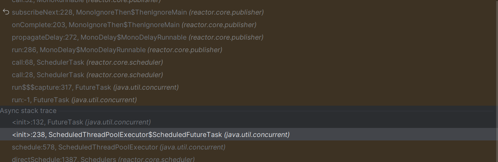

https://github.com/openjdk/jdk/blob/9728e21db1b35e487c562690de659aac386aa99d/src/java.base/share/classes/java/util/concurrent/ScheduledThreadPoolExecutor.java#L134

I found this out while I was, out of curiosity, stepping through the `Mono.delay` code in [Project Reactor](https://projectreactor.io/). 

tags: #java #thread-pool #executor #scheduled-thread-pool-executor #scheduled-executor-servic

