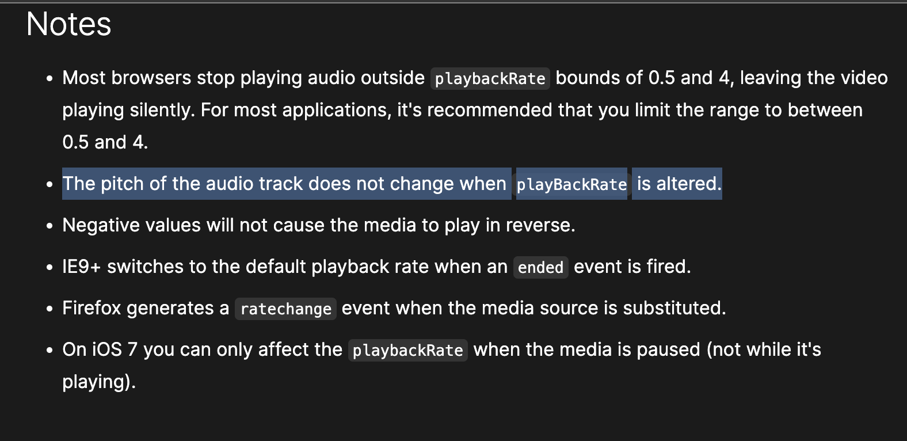
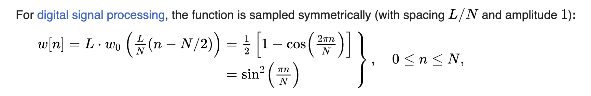

https://github.com/chromium/chromium/blob/83bb817fc3ce56490369f55e940a55795ea9637c/media/filters/audio_renderer_algorithm.cc#L278

So I have been playing around with the audio processing stuff in Chrome and noticed that when you change playbackRate, it doesn't affect the pitch of the audio. The browser apparently [tried to preserve the pitch](https://developer.mozilla.org/en-US/docs/Web/Guide/Audio_and_video_delivery/WebAudio_playbackRate_explained#notes).



```cpp
 // Use resampling when no pitch adjustments are needed.
  if (!preserves_pitch_)
    return ResampleAndFill(dest, dest_offset, requested_frames, playback_rate);

  SetFillBufferMode(FillBufferMode::kWSOLA);

  // Allocate structures on first non-1.0 playback rate; these can eat a fair
  // chunk of memory. ~56kB for stereo 48kHz, up to ~765kB for 7.1 192kHz.
  if (!ola_window_) {
    ola_window_.reset(new float[ola_window_size_]);
    internal::GetPeriodicHanningWindow(ola_window_size_, ola_window_.get());

    transition_window_.reset(new float[ola_window_size_ * 2]);
    internal::GetPeriodicHanningWindow(2 * ola_window_size_,
                                       transition_window_.get());

    // Initialize for overlap-and-add of the first block.
    wsola_output_ =
        AudioBus::Create(channels_, ola_window_size_ + ola_hop_size_);
    wsola_output_->Zero();

    // ....
```

To do this, it uses a WSOLA algorithm, which is a time-stretching algorithm. As a part of that algorithm, it uses a Hanning window to smooth out the transition between the different time-stretched segments.

```cpp
void GetPeriodicHanningWindow(int window_length, float* window) {
  const float scale = 2.0f * base::kPiFloat / window_length;
  for (int n = 0; n < window_length; ++n)
    window[n] = 0.5f * (1.0f - std::cos(n * scale)); 
}
```

The `window[n] = 0.5f * (1.0f - std::cos(n * scale)); ` part is the [Hanning window](https://en.wikipedia.org/wiki/Hann_function).




